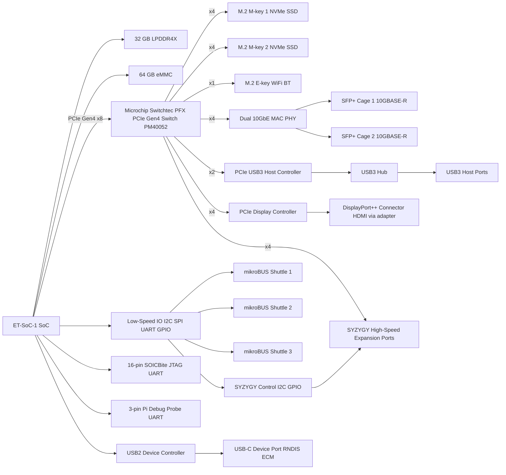
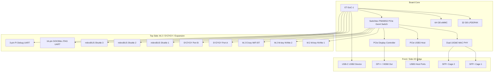

# Alien Board

Alien Board is an open source single-board-computer design around
Esperanto ET-SoC-1 that can support stand-alone operation,
including remote operation over WiFi/Ethernet and desktop-style operation.

## Block Overview

Alien Board is built around the Esperanto **ET-SoC-1** device, exposing its PCIe Gen4 x8 interface and low-speed I/O into a flexible high-speed expansion platform.

### Compute and Memory

- **ET-SoC-1 SoC** – primary compute, AI, and control engine.
- **32 GB LPDDR4X** – main system memory. (Let us max-out the local memory.)
- **64 GB eMMC** – non-volatile storage for bootloader, OS, and base software image. (This is largely just for boot with bulk data living on the SSDs, but also for an "out-of-box" experience.)

### High-Speed PCIe Fabric

A **Microchip Switchtec PFX PM40052 (52-lane, PCIe Gen4)** switch receives the SoC’s PCIe Gen4 x8 link and fans it out into multiple downstream ports: (We can probably find a cheaper switch, but we want to make sure to get good utilization of this primary mechanism for high-speed I/O.)

- **2× M.2 M-key NVMe SSD slots** (typically x4 each) (It is critical to have high-speed local storage under control of the SoC.)
- **1× M.2 E-key slot** for WiFi/Bluetooth (x1) (Best to have a WiFi option.)
- **Dual-port 10GbE NIC** connected to:
  - **2× SFP+ cages** for 10GBASE-R optical/DAC modules
- **PCIe USB3 host controller** feeding a USB3 hub and multiple USB3 ports (USB3 is great for off-the-shelf cameras and also enables keyboards/mice and video adapters.)
- **PCIe display controller** providing DisplayPort++ (HDMI via passive adapter) (There should be some kind of out-of-box display option for the keyboard/monitor/mouse types.)
- **Remaining high-speed lanes routed to [SYZYGY](https://syzygyfpga.io/) high-speed connectors**
  for custom high-performance expansion  (May stuggle with this due to the SERDES being locked down to PCIe.)

### Expansion, I/O and Debug

- **3× mikroBUS shuttle connectors** using I²C, SPI, UART, and GPIO signals.
- **SYZYGY high-speed connectors** for DAQ, networking, sensor front-ends, and custom pods with
  I²C + GPIO for configuration, presence detect, and power.
- **USB3 host ports** via PCIe USB3 controller + hub.
- **USB2 device port (USB-C)** for BeagleBoard-style “networking over USB” workflows:
  - RNDIS/ECM Ethernet gadget
  - USB serial console
  - Optional mass-storage gadget
- **16-pin SOICBite JTAG/UART connector** for bring-up and debug.
- **3-pin Pi Debug Probe UART header** for simple serial access.

## Example Applications

Alien Board is intended as a flexible “edge accelerator” and experimentation platform for high-speed, high-I/O embedded systems. Some example use cases:

### Stand-Alone Large Language Models and Smart Speakers
- Run medium-to-large language models entirely offline.
- Build a smart speaker powered by local inference, no cloud required.
- Pair with onboard WiFi or SFP+ for integration into home automation.

### On-Device AI for Drones and Robotics
- Use ET-SoC-1 as the AI perception and planning brain.
- Bring in cameras or sensors over SYZYGY or USB3.
- Perform SLAM, obstacle avoidance, and control loops directly on-board.

### High-Speed Data Acquisition and Instrumentation
- Use SYZYGY or PCIe endpoints to attach high-speed ADC/DAC modules.
- Stream multi-gigabit data directly to NVMe.
- Perform local signal processing, FFTs, ML-based anomaly detection.
- Ideal for software-defined radio, radar/lidar prototyping, industrial sensing, or lab automation.

### Hardware-in-the-Loop (HIL) and Automated Test Systems
- Integrate with production-test ecosystems like power controllers and relay boards.
- Use Alien Board as a fully programmable tester:
  - power cycling
  - firmware loading
  - signal capture and analysis
  - automated pass/fail criteria
- High-speed links allow real-time capture and logging to NVMe.
- Imagine [Blue Clover test jigs](https://bcdevices.com) and [BootLoop code generation](https://bootloop.ai)

### TV Monitoring and Content Filtering
- Capture HDMI or DisplayPort input via add-on pods.
- Use on-device AI to detect commercials, objectionable content, or logos.
- Output filtered or annotated content over HDMI/DP.
- Ideal for parental controls, ad detection, or accessibility overlays.

### Fully Open-Source GPU / Compute Pipelines
- Combine ET-SoC-1’s AI compute with open-source-friendly PCIe display devices.
- Use PCIe display controller only for scan-out, while ET-SoC-1 handles heavy rendering and ML tasks.
- Explore open graphics stacks, Vulkan compute, shader prototyping, etc.

These examples are intended as starting points. The board is deliberately over-provisioned on PCIe lanes and connectors to support experimental pods and novel high-speed interfaces.

## Form-factor

Alien Board should target something like a NUC form-factor, which is about 10 x 10 cm (4 x 4 inches).

